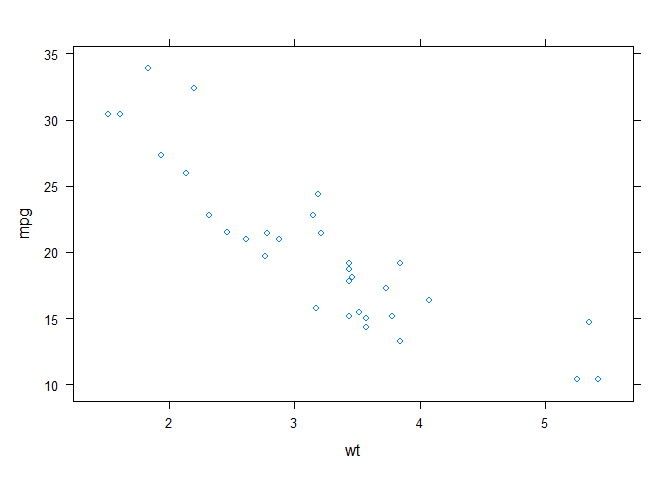
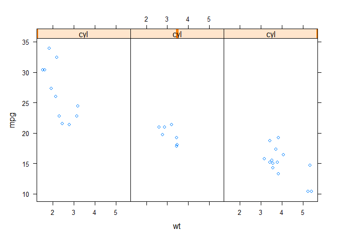

`Week 2` Exploratory Data Analysis
================

-   👨🏻‍💻 Author: Anderson H Uyekita
-   📚 Specialization: <a
    href="https://www.coursera.org/specializations/data-science-foundations-r"
    target="_blank" rel="noopener">Data Science: Foundations using R
    Specialization</a>
-   📖 Course:
    <a href="https://www.coursera.org/learn/exploratory-data-analysis"
    target="_blank" rel="noopener">Exploratory Data Analysis</a>
    -   🧑‍🏫 Instructor: Roger D Peng
-   📆 Week 2
    -   🚦 Start: Tuesday, 07 June 2022
    -   🏁 Finish: Wednesday, 08 June 2022

------------------------------------------------------------------------

#### Assignments & Deliverables

-   💻 Swirl
    -   Lattice Plotting System
    -   Working with Colors
    -   GGPlot2 Part1
    -   GGPlot2 Part2
    -   GGPlot2 Extras
-   [📝 Quiz 1](./quiz-2_exploratory-data-analysis.md)

------------------------------------------------------------------------

#### Slides

-   Lesson 1: Lattice Plotting System <a href="" id="lesson-1"></a>
    -   [Lattice Plotting System](./slides/2_1_plotting-lattice.pdf)
-   Lesson 2: ggplot2 <a href="" id="lesson-2"></a>
    -   [ggplot2](./slides/2_2_ggplot-2.pdf)

------------------------------------------------------------------------

## Class Notes

### [<kbd>Lesson 1</kbd>](#lesson-1) Lattice Plotting System in R

**The Lattice Plotting System**

The lattice plotting system is implemented using `lattice` and `grid`
packages.

> -   lattice: contains code for producing Trellis graphics, which are
>     independent of the “base” graphics system; includes functions like
>     `xyplot`, `bwplot`, `levelplot`
> -   grid: implements a different graphing system independent of the
>     “base” system; the lattice package builds on top of grid
> -   The lattice plotting system does not have a “two-phase” aspect
>     with separate plotting and annotation like in base plotting
> -   All plotting/annotation is done at once with a single function
>     call

**Lattice Functions**

> -   `xyplot`: this is the main function for creating scatterplots
> -   `bwplot`: box-and-whiskers plots (“boxplots”)
> -   `histogram`: histograms
> -   `stripplot`: like a boxplot but with actual points
> -   `dotplot`: plot dots on “violin strings”
> -   `splom`: scatterplot matrix; like `pairs` in base plotting system
> -   `levelplot`, contourplot: for plotting “image” data

Lattice functions generally take a formula for their first argument,
usually of the form

    xyplot(y ~ x | f * g, data)

We use the formula notation here, hence the `~` on the left of the `~`
is the y-axis variable, on the right is the x-axis variable.

``` r
library(datasets)
library(lattice)

# Scatter plot example.
xyplot(x = mpg ~ wt, data = mtcars)
```

<!-- -->

`f` and `g` are conditioning variables — they are optional, the `*`
indicates an interaction between two variables.

``` r
# Scatter plot example with facets.
xyplot(x = mpg ~ wt | cyl, data = mtcars)
```

<!-- -->

The second argument is the data frame or list from which the variables
in the formula should be looked up.

-   If no data frame or list is passed, then the parent frame is used.
-   If no other arguments are passed, there are defaults that can be
    used.

**Lattice Behavior**

Lattice functions behave differently from base graphics functions in one
critical way.

> -   Base graphics functions plot data directly to the graphics device
>     (screen, PDF file, etc.)
> -   Lattice graphics functions return an object of class trellis
> -   The print methods for lattice functions actually do the work of
>     plotting the data on the graphics device.
> -   Lattice functions return “plot objects” that can, in principle, be
>     stored (but it’s usually better to just save the code + data).
> -   On the command line, trellis objects are auto-printed so that it
>     appears the function is plotting the data

**Summary**

> -   Lattice plots are constructed with a single function call to a
>     core lattice function (e.g. xyplot)
> -   Aspects like margins and spacing are automatically handled and
>     defaults are usually sufficient
> -   The lattice system is ideal for creating conditioning plots where
>     you examine the same kind of plot under many different conditions
> -   Panel functions can be specified/customized to modify what is
>     plotted in each of the plot panels

### [<kbd>Lesson 2</kbd>](#lesson-2) Plotting with ggplot2

**Summary**
