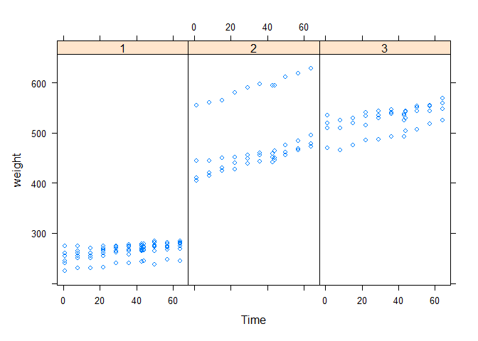
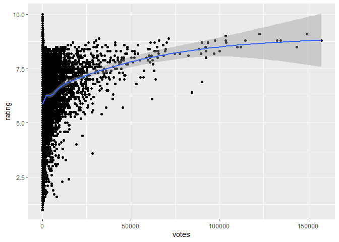

`Quiz 2` Exploratory Data Analysis
================

-   👨🏻‍💻 Author: Anderson H Uyekita
-   📚 Specialization: <a
    href="https://www.coursera.org/specializations/data-science-foundations-r"
    target="_blank" rel="noopener">Data Science: Foundations using R
    Specialization</a>
-   📖 Course:
    <a href="https://www.coursera.org/learn/exploratory-data-analysis"
    target="_blank" rel="noopener">Exploratory Data Analysis</a>
    -   🧑‍🏫 Instructor: Roger D Peng
-   📆 Week 2
    -   🚦 Start: Tuesday, 07 June 2022
    -   🏁 Finish: Wednesday, 08 June 2022
-   🌎 Rpubs: [Interactive
    Document](https://rpubs.com/AndersonUyekita/quiz-1_exploratory-data-analysis)

------------------------------------------------------------------------

## Question 1

Under the lattice graphics system, what do the primary plotting
functions like `xyplot()` and `bwplot()` return?

-   [ ] nothing; only a plot is made
-   [x] an object of class “trellis”
-   [ ] an object of class “plot”
-   [ ] an object of class “lattice”

> According to slide 7 from [the Lattice Plotting System in
> R](./slides/2_1_plotting-lattice.pdf) document:
>
> -   Lattice graphics functions return an object of the class trellis.

## Question 2

What is produced by the following code?

    library(nlme)
    library(lattice)
    xyplot(weight ~ Time | Diet, BodyWeight)

-   [x] A set of 3 panels showing the relationship between weight and
    time for each diet.
-   [ ] A set of 3 panels showing the relationship between weight and
    time for each rat.
-   [ ] A set of 11 panels showing the relationship between weight and
    diet for each time.
-   [ ] A set of 16 panels showing the relationship between weight and
    time for each rat.

First, we need to investigate the `nlme` package and what is inside of
`BodyWeight` dataset.

``` r
library(nlme)
library(lattice)

# First rows of BodyWeight dataset.
head(nlme::BodyWeight)
```

    ## Grouped Data: weight ~ Time | Rat
    ##   weight Time Rat Diet
    ## 1    240    1   1    1
    ## 2    250    8   1    1
    ## 3    255   15   1    1
    ## 4    260   22   1    1
    ## 5    262   29   1    1
    ## 6    258   36   1    1

``` r
# Counting the number of Diet factors
length(unique(nlme::BodyWeight$Diet))
```

    ## [1] 3

We already know the graphic should present 3 facets.

Also, according to the Lattice Graphic notation, `weight` will be on the
y-axis and `Time` on the x-axis.

``` r
# Printing the Lattice Graphic to prove it.
xyplot(weight ~ Time | Diet, BodyWeight)
```

<!-- -->

**The graphic will display three facets presenting how each `Diet` will
affect the Weight over `Time`.**

## Question 3

Annotation of plots in any plotting system involves adding points,
lines, or text to the plot, in addition to customizing axis labels or
adding titles. Different plotting systems have different sets of
functions for annotating plots in this way.

Which of the following functions can be used to annotate the panels in a
multi-panel lattice plot?

-   [ ] points()
-   [ ] lines()
-   [x] panel.lmline()
-   [ ] axis()
-   [x] llines()

Based on slides 11 and 12 from [The Lattice Plotting System in
R](./slides/2_1_plotting-lattice.pdf) document, I found a way to add an
annotation in Lattice using the `panel.xyz()`, where `xyz()` could be
abline lmline or other function.

The example on slide 12 uses the `panel.lmline()` annotation.

To better understand `llines()`, I have used the `?llines`.

## Question 4

The following code does NOT result in a plot appearing on the screen
device.

    library(lattice)
    library(datasets)
    data(airquality)
    p <- xyplot(Ozone ~ Wind | factor(Month), data = airquality)

Which of the following is an explanation for why no plot appears?

-   [ ] The xyplot() function, by default, sends plots to the PDF
    device.
-   [ ] The variables being plotted are not found in that dataset.
-   [ ] There is a syntax error in the call to xyplot().
-   [x] The object ‘p’ has not yet been printed with the appropriate
    print method.

The graphic is OK unless it lacks a printing command to show it. The
auto-printing will only work if the plot is not assigned to a variable,
which is the current case.

## Question 5

In the lattice system, which of the following functions can be used to
finely control the appearance of all lattice plots?

-   \[x\]trellis.par.set()
-   \[ \]splom()
-   \[ \]par()
-   \[ \]print.trellis()

`?trellis.par.set`.

> **Description**
>
> Functions used to query, display and modify graphical parameters for
> fine control of Trellis displays. Modifications are made to the
> settings for the currently active device only.

## Question 6

What is ggplot2 an implementation of?

-   [ ] the base plotting system in R
-   [ ] the S language originally developed by Bell Labs
-   [ ] a 3D visualization system
-   [x] the Grammar of Graphics developed by Leland Wilkinson

Found in slide 2 of [ggplot2](./slides/2_2_ggplot-2.pdf) document.

> An implementation of the Grammar of Graphics by Leland Wilkinson

## Question 7

Load the \`airquality’ dataset form the datasets package in R

    library(datasets)
    data(airquality)

I am interested in examining how the relationship between ozone and wind
speed varies across each month. What would be the appropriate code to
visualize that using ggplot2?

-   [ ]
    `qplot(Wind, Ozone, data = airquality, facets = . ~ factor(Month))`
-   [ ] `qplot(Wind, Ozone, data = airquality)`
-   [ ] `qplot(Wind, Ozone, data = airquality, geom = "smooth")`
-   [x]
    `airquality = transform(airquality, Month = factor(Month)); qplot(Wind, Ozone, data = airquality, facets = .~Month)`

The `transform()` function explicitly ensures the Month variable will be
a factor. Although, the `. ~factor(Month)` is more neatly for me.

## Question 8

What is a `geom` in the ggplot2 system?

-   [ ] a statistical transformation
-   [x] a plotting object like point, line, or other shape
-   [ ] a method for making conditioning plots
-   [ ] a method for mapping data to attributes like color and size

According to the slide 24 of [Ggplot2](./slides/2_2_ggplot-2.pdf)
Document.

> -   `geoms`: geometric objects like points, lines, shapes.

## Question 9

When I run the following code I get an error:

    library(ggplot2)
    library(ggplot2movies)
    g <- ggplot(movies, aes(votes, rating))
    print(g)

I was expecting a scatterplot of ‘votes’ and ‘rating’ to appear. What’s
the problem?

-   [x] ggplot does not yet know what type of layer to add to the plot.
-   [ ] There is a syntax error in the call to ggplot.
-   [ ] The object ‘g’ does not have a print method.
-   [ ] The dataset is too large and hence cannot be plotted to the
    screen.

It is necessary to install the `ggplot2movies` package. The problem
relies on the lack of geom method to select the way graphic will display
the data.

## Question 10

The following code creates a scatterplot of ‘votes’ and ‘rating’ from
the movies dataset in the ggplot2 package. After loading the ggplot2
package with the library() function, I can run

    qplot(votes, rating, data = movies)

How can I modify the the code above to add a smoother to the
scatterplot?

-   [ ] qplot(votes, rating, data = movies) + stats_smooth(“loess”)
-   [ ] qplot(votes, rating, data = movies, smooth = “loess”)
-   [x] qplot(votes, rating, data = movies) + geom_smooth()
-   [ ] qplot(votes, rating, data = movies, panel = panel.loess)

There are two ways to do it:

Option 1 - Example on slide 9 from [Gpplot2](./slides/2_2_ggplot-2.pdf)
document

``` r
# Adding geom argument on qplot function:
qplot(votes, rating, data = movies, geom = c("point","smooth"))
```

<!-- -->

Option 2 - Example on slide 19 from [Gpplot2](./slides/2_2_ggplot-2.pdf)
document

``` r
# Adding geom_smooth to qplot function:
qplot(votes, rating, data = movies) + geom_smooth()
```

<!-- -->

<!-- Inner references -->
